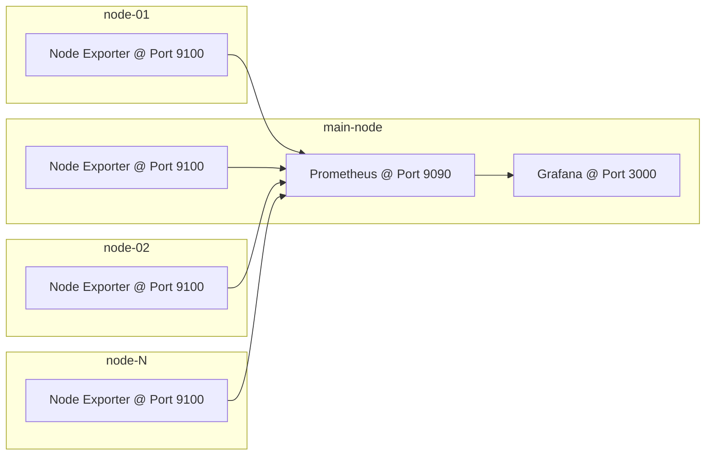

# Granafa + Prometheus + Node Exporter

Monitor several nodes

## Structure



1. Node Exporter logs necessary performance data on each node, which is availble on default address of `node-ip:9100`.
2. Prometheus, on the main node, gathers are data collected by Node Exporter. Prometheus is available on the `main-node:9090`. This is the data source for grafana.
3. All the data is availble on grafana after defining the data source. Grafana is installed on the `main-node:3000`.

## Playbook

Playbook tasks and tags are as follows:

```log
playbook: grafana-main.yml

  play #1 (hq_host): install grafana and prometheus on the main host a.k.a hq_host	TAGS: [config-hq-host]
    tasks:
      install grafana with snap	TAGS: [config-hq-host, snap-install]
      enable grafana snap service	TAGS: [config-hq-host, snap-service]
      create directory to dl prometheus @ PROMETHEUS_INSTALL_PATH	TAGS: [config-hq-host, create-dir]
      download prometheus @ PROMETHEUS_INSTALL_PATH	TAGS: [config-hq-host, download]
      unzip prometheus	TAGS: [config-hq-host, unzip]
      copy prometheus config from PROMETHEUS_CONFIG_PATH	TAGS: [config-hq-host, copy-prom-conf]
      copy prometheus systemd service file	TAGS: [config-hq-host, systemd]
      systemd daemon-reload	TAGS: [config-hq-host, systemd]
      enable prometheus systemd service	TAGS: [config-hq-host, systemd]
      TASK TAGS: [config-hq-host, copy-prom-conf, create-dir, download, snap-install, snap-service, systemd, unzip]

  play #2 (all): Install Node Exporter on all hosts	TAGS: [node-exporter-install-all]
    tasks:
      create the desired path to download files	TAGS: [dir-check, node-exporter-install-all]
      download node-expoter	TAGS: [download, node-exporter-install-all]
      unzip node-exporter	TAGS: [node-exporter-install-all, unzip-files]
      copy systemd service file to /etc/systemd/system/	TAGS: [node-exporter-install-all, systemd]
      systemd daemon-reload	TAGS: [node-exporter-install-all, systemd]
      systemd-service start	TAGS: [node-exporter-install-all, systemd]
      TASK TAGS: [dir-check, download, node-exporter-install-all, systemd, unzip-files]
```

## Variables

|Name|Play|Description|
|:-|:-|:-|
|`PROMETHEUS_INSTALL_PATH`|`play #1`|Path to install Prometheus|
|`PROMETHEUS_CONFIG_PATH`|`play #1`|Path to place Prometheus config file|
|`PROMETHEUS_EXEC_PATH`|`play #1`|Path of Prometheus executable file|
|`NODE_EXPORTER_PATH`|`play #2`|Path to download and install Node Exporter|
|`NODE_EXPORTER_EXEC_PATH`|`play #2`|Path of Node Exporter executable|

## Dashboard
A minimal dashboard is also available in the path `dashboard/dashboard.json`  

.png)

## TODO

1. Add MySQL as the backend db for Grafana
2. Separate variables file
