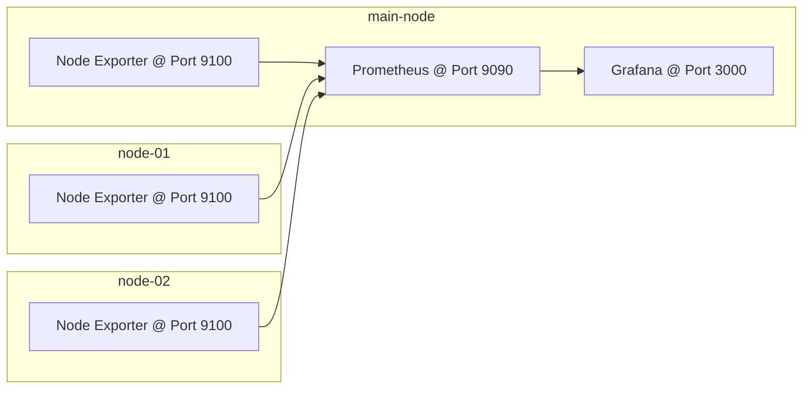

# Granafa + Prometheus + Node Exporter
Monitor several nodes

```mermaid
flowchart LR

subgraph main-node
node_exporter[Node Exporter @ Port 9100]
prometheus[Prometheus @ Port 9090]
grafana[Grafana @ Port 3000]
end

subgraph node-01
node_exporter1[Node Exporter @ Port 9100]
end

subgraph node-02
node_exporter2[Node Exporter @ Port 9100]
end

node_exporter-->prometheus
node_exporter1-->prometheus
node_exporter2-->prometheus
prometheus-->grafana
```
